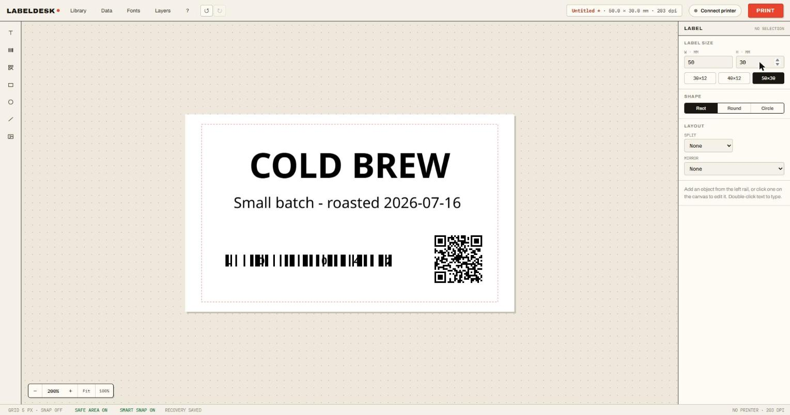

# LabelDesk

LabelDesk is a desktop-first, browser-based label designer for NIIMBOT thermal
printers. Design labels on a Fabric.js canvas, connect directly over Web
Bluetooth, preview the exact one-bit output, and print without installing a
native application.



## Use it now

**<https://keralots.github.io/LabelDesk/>** - nothing to install.

Open the link in a current Chromium-based browser (Chrome or Edge on Windows,
macOS, Linux, or Android), click **Connect printer**, pick your NIIMBOT
printer, and print.

LabelDesk is free and open source. There is no backend server: no accounts, no
uploads, and no data collection. Everything you design stays in your browser
unless you export it to a file yourself.

> [!IMPORTANT]
> LabelDesk is an independent, unofficial project. It is not affiliated with,
> endorsed by, or sponsored by NIIMBOT, MultiMote, or niimblue. Printer
> communication uses `@mmote/niimbluelib`, and portions of the editor are
> derived from MIT-licensed niimblue code. See
> [Third-party notices](THIRD_PARTY_NOTICES.md).

All product names and trademarks belong to their respective owners.

## Status and compatibility

LabelDesk is under active development. The NIIMBOT D110 at 203 dpi (8 dots/mm)
is the primary test device and has been physically verified for normal label
printing and multi-row CSV batch printing.

The printer protocol is unofficial and reverse engineered. Printer firmware or
future library changes may affect compatibility. Keep `@mmote/niimbluelib`
pinned to an exact version and physically verify printer-related updates.

Web Bluetooth requires a compatible Chromium-based browser such as current
Chrome or Edge. A deployed copy must use HTTPS; `localhost` is allowed during
development.

## Features

- Fabric.js editor with text, images, barcodes, QR codes, shapes, and ArUco markers
- Exact print preview with threshold, dithering, rotation, and density controls
- CSV batch printing with `{column}` variables, `$times`, ranges, and copies
- Local template library, autosave, crash recovery, JSON import/export, and PNG export
- Multi-selection, alignment, distribution, grouping, layers, guides, and keyboard shortcuts
- Local custom font import with optional portable template embedding

## Privacy

LabelDesk has no analytics, accounts, telemetry, or application server. Labels,
CSV data, autosave state, templates, and imported custom fonts stay in the
browser's local storage unless the user explicitly exports a file.

The application bundles its UI fonts and does not contact Google Fonts. A
hosted provider such as GitHub Pages may still log normal web-server request
metadata. Bluetooth communication takes place directly between the browser and
the selected printer.

For safety and privacy, imported templates accept only supported Fabric.js
objects and embedded raster-image data. Remote image URLs are rejected.

## Development

Requirements: Node.js 20.19 or newer and npm.

```sh
npm ci
npm run dev
```

Open <http://localhost:5180> in Chrome or Edge.

```sh
npm test        # unit tests
npm run check   # Svelte and TypeScript checks
npm run build   # production build in dist/
npm run preview # serve the production build locally
```

The production build uses relative asset paths, so the same `dist` directory
can be hosted at a domain root or a project path such as `/LabelDesk/`.

## CSV batch printing

Open **Data** in the top bar to import or edit comma-separated data. The first
row defines placeholder names:

```csv
name,sku,$times
Widget A,ABC-001,2
Widget B,ABC-002,1
```

Use `{name}` or `{sku}` in text, QR code, and barcode values. `$times` sets the
quantity for that row and is multiplied by **Copies** in the print dialog. The
preview can navigate source rows and print all rows or an inclusive range.

Saved and exported labels omit CSV data by default. Enable **Include batch
data** only when the data should travel with the template.

## Recovery, editing, and exports

LabelDesk automatically saves the active canvas, label settings, document name,
and enabled batch data in the browser. Reloading restores that working session.
The title displays an asterisk when the document differs from the last library
save, JSON export, or loaded template.

Use **Export PNG** to save the current label as a one-pixel-per-printer-dot
image. Multi-selection supports edge and center alignment, equal-gap
distribution, grouping, stacking order, and shared text properties. **Fit text
to 90%** finds the largest font size that fits inside a safe label margin.

## Keyboard shortcuts

- `Ctrl+C`, `Ctrl+X`, and `Ctrl+V` - copy, cut, and paste selected objects
- `Ctrl+D` - duplicate the selection
- `Ctrl+A` - select all label objects
- `Ctrl+G` and `Ctrl+Shift+G` - group and ungroup
- `Ctrl+Z`, `Ctrl+Shift+Z`, and `Ctrl+Y` - undo and redo
- Arrow keys - move by one dot; hold Shift to move by ten dots
- `Delete` or `Backspace` - delete the selection
- `Escape` - clear the selection

Canvas shortcuts are inactive while editing text, typing in a form field, or
using a dialog.

## Custom fonts

Open **Fonts** to import a local TTF, OTF, WOFF, or WOFF2 file. Custom fonts stay
in the current browser and become available in text selectors. Saved and
exported labels omit font files by default. Enable **Include custom fonts** to
embed only the custom families used by the current canvas.

Only import font and template files from sources you trust. Imported files are
size-limited and validated, but complex font parsing is ultimately performed by
the browser.

## Security

Please do not open a public issue for a suspected vulnerability. Follow the
private reporting instructions in [SECURITY.md](SECURITY.md).

## Support the project

LabelDesk is a free hobby project. If it saves you time, you can support
development at [ko-fi.com/keralots](https://ko-fi.com/keralots).

## License

LabelDesk is released under the [MIT License](LICENSE). Third-party components
retain their original licenses and copyright notices; see
[THIRD_PARTY_NOTICES.md](THIRD_PARTY_NOTICES.md).

The software is provided without warranty. Use it with printers and label media
at your own risk.
